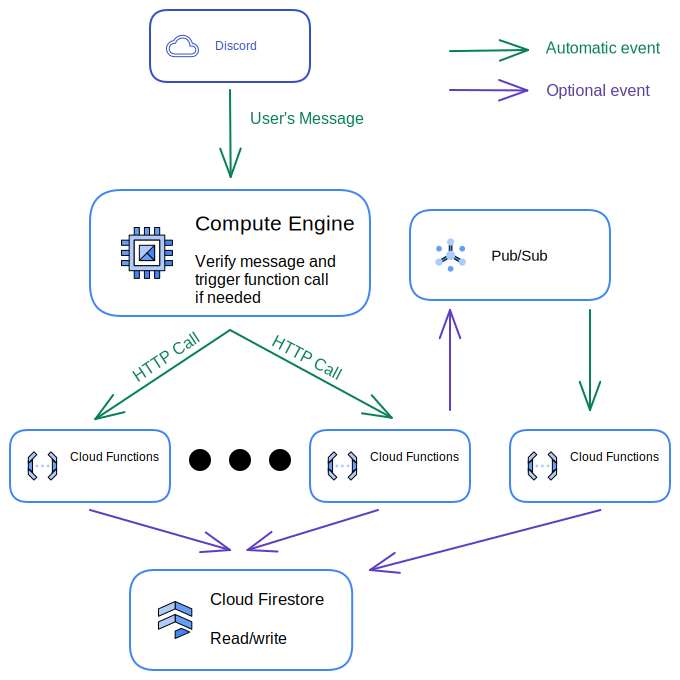

<div align="center">
  <br>
  
  <h1>🐸 Archy 🐸</h1>
  <strong>Open source serverless bot!</strong>
</div>
<br>
<p align="center">
  <a href="https://github.com/ArmandBriere/archy/issues">
    
  </a>
  <a href="https://github.com/ArmandBriere/archy/releases">
    
  </a>
  <a href="https://discord.gg/y76YCwFp3d">
    
  </a>
</p>

## 📖 Prerequisites

This project is designed to run on Google Cloud with a Compute Engine instance and many cloud functions.

## ☁ Global architecture

<div align="center">
  
</div>

This project is designed to run on Google Cloud.

The "main node" is a Compute Engine running a Docker container with [Python code](https://github.com/ArmandBriere/Archy/blob/main/src/main.py). This node is here to parse every discord message to find commands.

Every command is running inside Cloud Functions. This allows us to develop those in any [supported languages](https://cloud.google.com/functions/docs/writing).

Functions can trigger other functions using [Pub/Sub](https://cloud.google.com/pubsub/docs/overview).

All data is stored in [Firestore](https://firebase.google.com/docs/firestore).

In addition to this, we also have a web page developed in Angular on [Firebase Hosting](https://firebase.google.com/docs/hosting)

## 🖥️ Local development

- Bot and commands -> [README](https://github.com/ArmandBriere/Archy/blob/main/src/README.md)
- Web -> [README](https://github.com/ArmandBriere/Archy/blob/main/web/README.py)

## 🤝 Contributing

We encourage you to contribute to Archy! Come to our [discord server](https://discord.gg/y76YCwFp3d) to talk about your ideas and changes!

- Note that all development is done in English, please do your best to code, commit and comment issues/PR in English.

Feel free to submit PRs for small issues. For large issues or features, open an issue first.

(Disclaimer: We took the contribution work flow from [fireship.io](https://github.com/fireship-io/fireship.io))

### Option 1 - Simple Typo Fixes

For small issues, like a typo or broken link, use Github's inline file editor or web editor (open by pressing . in your fork's code tab) to make the fix and submit a pull request.

### Option 2 - Work on your own Fork

For more complex contributions, like guest posts and new features, you should work on the project on your local system.

First, fork this repo on GitHub.

```bash
git clone <your-forked-repo>

git checkout -b my-fix
# fix some code...

git commit -m "fix: corrected a typo"
git push origin my-fix
```
